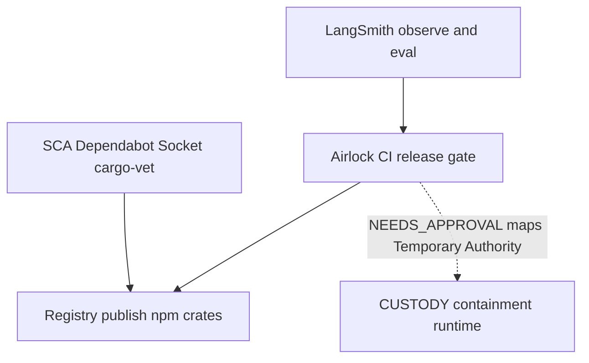

# Airlock roadmap

What shipped, what we need to prove next, and what waits for a paid control plane.

Install and overview: [README](../README.md). History: [CHANGELOG](../CHANGELOG.md). Cut a release: [RELEASING](RELEASING.md).

## Thesis

**Airlock is the release gate for AI agents** — GitHub Actions for safely shipping them.

It is not an eval platform. It is not AI observability. It is not a lifecycle or governance suite. It is not intelligent code-CI or unit-test selection.

The production question:

> Can I safely allow this AI change to reach production?

```text
What changed? (prompt / skill / MCP / model / tool / eval / deps)
      ↓
What agents are affected?          (blast radius)
      ↓
What production capabilities changed?  (permissions, schemas)
      ↓
What evaluations should run?
      ↓
Quality / cost / permission regress?
      ↓
Who must approve?
      ↓
SHIP / BLOCK / NEEDS_APPROVAL
```

**Open-core:**

| Free (OSS) | Paid later |
|------------|------------|
| CLI, GitHub Action, `.airlock/` store | Hosted control plane |
| Snapshot / diff / blast radius | Shared history, org policy, environments |
| Local evals + policy engine | Approvals (Slack / Teams), regression analytics |
| Basic release gates in CI | SSO / RBAC, audit, EU residency, private runners |

Prove the OSS gate in real CI first. Build the control plane around data those teams already produce. There is no hosted control plane today.

## Where we are

| Layer | Status |
|-------|--------|
| OSS AI release gate | Mostly here. Phase 0–4 shipped as a local-first Go CLI plus a reusable Action |
| Team / enterprise control plane | Not built. Phase 5–6 |
| Release agent (investigate → recommend rollback → open PR) | Not started. Phase 7; only after the gate is trusted |

The OSS beta answers: one PR → Airlock understands the AI change → runs the right checks → a trustworthy release decision. That is the product today.

Not claimed as done: every framework SDK AST, a hosted dashboard, multi-org policy, an autonomic rollback agent.

## The problem

Software has a release pipeline. Agents often do not.

Behavior can change when someone edits a prompt, adds a skill, widens an MCP tool, or a model moves behind a stable string. Traditional CI stays green. Production does not.

**Airlock** is the **CI release gate** for that surface: snapshot what the agent is, diff the blast radius, evaluate with confidence, then `PASS` / `FAIL` / `INCONCLUSIVE` / `NEEDS_APPROVAL`.

It is **not**:

- an observability or prompt playground (LangSmith and friends)
- a generic eval SaaS (Promptfoo / Braintrust host that)
- a runtime containment framework (CUSTODY)
- a package-malware scanner (Dependabot, Socket, cargo-vet, Sigstore)
- a managed agent host or payment rail
- **intelligent unit-test selection / “CI for all AI-written code”** (different product; see [non-goals](#non-goals))

Those tools answer different questions. Airlock answers: **is this AI change safe to release?**

## Where it sits in the stack



| Layer | Job | Airlock’s role |
|-------|-----|----------------|
| Observe / iterate | Traces, datasets, playground | Keep LangSmith (and similar). Import scores later |
| **Release gate** | Ship / block / approve on the PR | **Airlock today** |
| Contain at runtime | Granted authority ≈ effective authority | CUSTODY (and PAM / network controls) |
| Package malware | Malicious npm / crates / PyPI | SCA scanners |
| Publish | Push artifacts to a registry | Phase 6: optional gate **beside** SCA |
| Spend | Caps, tokens, human approve on money | Stripe-style rails. Airlock gates the **agent surface** before that ships |

```text
edit agent artifacts
        →  observe / eval platforms (optional)
        →  Airlock snapshot / diff / policy / ci
        →  merge
        →  runtime containment (CUSTODY and friends)
        →  optional registry publish (+ SCA)
```

## Shipped (OSS beta)

Local-first Go CLI plus a reusable GitHub Action. State under `.airlock/`. No telemetry by default. Apache-2.0.

- **AI manifest** — agents, models, prompts, tools, skills, MCP, judges, evals (imports [APM](https://github.com/microsoft/apm) lockfiles)
- **Snapshot / diff** — content-addressed release record + blast radius
- **Policy engine** — statistical gates; `PASS` / `FAIL` / `INCONCLUSIVE` / `NEEDS_APPROVAL`
- **`airlock ci`** — PR-oriented decision; `--fail-on-eval` / `--fail-on-approval` / `--fail-on-inconclusive`
- **Skills and MCP** — first-class `skill`; skill / MCP power expansion → approval path; adversarial preference when those change
- **Promptfoo import**, cassette replay, judge calibrate (beta-thin where noted)
- **OTel ingest → baseline / drift** — thin production loop
- **GitHub Action** — `uses: xdlc-labs/airlock@v0` ([README — Use it](../README.md#use-it-on-your-repo)). This repo dogfoods `uses: ./`.
- **Agent-driven supply chain** — APM package dependencies tracked as `manifest.Dependency`. A new dependency landing with an AI-artifact change (prompt / skill / MCP / agent) raises `NEEDS_APPROVAL`. A dependency-only PR is left to SCA
- **Model Sentinel** — `airlock sentinel probe|check`; silent provider drift when the config string did not change
- **Stack scanner** — OpenAI SDK + LangGraph heuristics; live MCP `tools/list` for HTTP(S) at scan time
- **Eval flexibility** — `.airlock/eval-bindings.yml`, experiment compare, `eval promote`, LangSmith / Braintrust / Promptfoo import, multi-turn judges
- **Lockfile supply chain** — `go.sum` / `package-lock.json` / `Cargo.lock` → the same agent-driven gate

Discovery coverage and the MCP demo: [Developer guide](GUIDE.md).

### Next proof

Before Phase 5 dashboard work: **10–20 serious AI teams** with the Action on real agent PRs, blocking at least one scary permission, prompt, or model change.

Harden what that needs: clearer PR comments, a tighter blast-radius and permission-expansion story, more reliable discovery for common stacks, fail-closed defaults that teams keep on.

Do **not** rush a huge hosted UI. Control plane follows CI trust.

### Known gaps

- stdio MCP servers stay config-hash only (no spawn and introspect). Live `tools/list` diffs cover HTTP(S) servers
- Python / yarn / pnpm lockfiles are not scanned for the agent-driven supply-chain gate (Go / npm / Cargo only)
- Framework detection is OpenAI SDK + LangGraph only (no Anthropic / LlamaIndex / CrewAI / AutoGen / Vercel AI SDK yet)

## Phase 5 — Team control plane (open-core paid)

Shared product for teams. The local-first CLI stays underneath.

| Item | Why | Steal / integrate |
|------|-----|-------------------|
| Shared history, approvals, audit | One repo’s `.airlock/` is not enough for an org | — |
| Team policy sync | Same gates across many agent repos | — |
| Environments | Staging vs prod agent configs | — |
| Slack / Teams approval hooks | Humans in the loop without leaving chat | — |
| Regression / release analytics | Cost + quality trends across releases | — |
| **Annotation / review queues** | Humans review borderline runs and feed eval corpora | LangSmith annotation queues as an idea. Airlock stays the gate + ledger |
| Org-level evaluator library | Attach one calibrated judge to many repos | LangSmith workspace evaluators as an idea |
| Connectors to eval platforms | Pull experiments / datasets into CI gates | Import. Do not host traces |

### CUSTODY-aligned vocabulary (SecOps)

[CUSTODY](https://github.com/malwarejake/CUSTODY-framework) is a **containment** framework: keep granted authority aligned with effective authority in infrastructure the agent cannot rewrite.

Airlock does **not** implement CUSTODY. We can **speak its language** so security readers can map the products:

| CUSTODY pillar | Airlock mapping |
|----------------|-----------------|
| **Temporary Authority** | MCP / skill / write-tool expansion → `NEEDS_APPROVAL` until `approve` |
| **Conditions of Release** | `.airlock/policy.yml` gates before merge |
| **Supervision & Stop** | Fail-closed CI (`--fail-on-approval` / `--fail-on-eval`); human in the loop |
| **Observability & Escalation** | Snapshots, history, OTel ingest / drift (thin today) |
| **Untrusted Input** | Adversarial suites when MCP / skills change — not a full prompt-injection product |
| **Yard & Egress / Disposal** | Runtime / infra — stay with CUSTODY and platform controls |

Runtime containment remains CUSTODY (and network / PAM). Airlock remains the **pre-merge** gate for the releasable agent unit.

## Phase 6 — Enterprise platform

Enterprise delivery and choke points after the team control plane exists.

| Item | Why |
|------|-----|
| SSO / SAML, RBAC | Org identity |
| Audit logs, compliance exports | Procurement |
| EU data residency, self-host / private runners | Data-boundary buyers |
| Multi-org / multi-environment | Platform teams |
| K8s admission / shadow releases | Stop bad agent configs at deploy time |
| **Registry publish gate** | Block `npm publish` / crate release until Airlock **and** SCA / attestations pass |
| GitHub / GitLab / Argo / Spinnaker hooks | Meet existing release systems |

**Explicit non-goal:** managed agent runtime, no-code Fleet-style host, or becoming the payment rail.

## Phase 7 — Release agent (after the gate is trusted)

Autonomic release engineering on top of a gate teams already believe.

```text
PR → Release Agent → Diff / Eval / Policy → SHIP or BLOCK
                         ↓
              Production telemetry
                         ↓
              detect regression → investigate → recommend rollback → open PR
```

Example outcome (valuable):

> Prompt v17 reduced task success 4.2% on customer-support cases, tool retries +18%, latency SLO exceeded — recommend block.

Not:

> Eval score = 0.82.

**Rule:** deterministic signals first (manifest diff, blast radius, policy, stats, Sentinel). The agent reasons **on top** of those. It does not invent the test set or override fail-closed policy by vibes.

Ship only after Phase 5-ish trust. A “release agent” demo without a trusted gate looks like another AI wrapper.

## Integration playbooks

### LangSmith / Braintrust / Langfuse / Phoenix

Keep them for traces, online evals, datasets, playground, annotation.

**Today**

1. Observe and curate in that platform.
2. In the app repo: `airlock init`, import or point at eval cases you trust (`import promptfoo` or JSONL).
3. Commit `.airlock/policy.yml`; add `uses: xdlc-labs/airlock@v0` ([README — Use it](../README.md#use-it-on-your-repo)). The Action fail-closes on approval.
4. Optional: `ingest otel` → baseline / drift (file / JSONL path — not a live LangSmith API sync yet).

**Later (Phase 5):** review queues that feed the gate — still no Airlock-hosted trace UI.

Also: [README — If you use LangSmith](../README.md#if-you-already-use-langsmith-braintrust-langfuse-or-phoenix).

### CUSTODY

| CUSTODY | Airlock |
|---------|---------|
| Contain the **running** agent | Gate **releasing** the agent unit |
| Control objectives in infra | Snapshot / diff / policy / CI |

Use both: Airlock before merge; CUSTODY (or equivalent) after deploy. Framework: [malwarejake/CUSTODY-framework](https://github.com/malwarejake/CUSTODY-framework) · [custody-framework.org](https://www.custody-framework.org/).

### Agent-driven supply chain

A coding agent can propose and merge a dependency at machine speed, alongside the prompt or skill edit that needed it. Airlock's angle is that co-occurrence, not malware detection.

- A new dependency landing **together with** an AI-artifact change (prompt / skill / MCP / agent) lands in blast radius and raises `NEEDS_APPROVAL`. `airlock ci --fail-on-approval` blocks the merge.
- A **dependency-only** PR with no AI-artifact change is left to Dependabot / SCA. Airlock stays quiet.
- Sources today: APM `apm.lock.yaml`, plus `go.sum` / `package-lock.json` / `Cargo.lock`. Python, yarn, and pnpm lockfiles are not scanned yet.

Airlock does not check whether a package is malware. Keep the scanners below.

### Package managers / SCA

| SCA | Airlock |
|-----|---------|
| Is this package malware / known-bad? | Did this **AI change** widen what we depend on? |
| Every PR / lockfile bump | Especially when prompt / skill / MCP / agent change co-occurs with lockfile churn |
| Required for publish | Phase 6: publish gate **beside** SCA |

Do not drop Dependabot / Socket / cargo-vet because Airlock exists.

### Money / Stripe-style agent pay

Stripe’s [giving agents the ability to pay](https://stripe.com/blog/giving-agents-the-ability-to-pay) (Link wallet / Issuing / Shared Payment Tokens) puts **caps, expiry, and human approve on the credential**. The model must not hold a blank check.

Same pattern as ledger-style approval DAGs: deterministic code owns amount and audit; the LLM proposes and flags.

**Airlock’s job:** gate the agent surface (tools, MCP, prompts, skills) **before** that money-capable agent ships. Payment rails own spend. Airlock owns “was this agent change approved to release?”

## Non-goals

- Replace LangSmith (or similar) as a trace / playground / deploy product
- Become a generic **AI evaluation platform** (we gate; they score)
- Implement the CUSTODY framework as a product (vendor-neutral objectives stay theirs)
- Replace Dependabot / Socket / cargo-vet / Sigstore for classic package malware
- Re-implement [APM](https://github.com/microsoft/apm) package resolution (Airlock **imports** lockfiles)
- Host managed agents / Fleet-style no-code runtime
- Become a payment or issuing provider
- **Intelligent unit-test / suite selection for ordinary application CI** (“run 320 of 8000 tests”) — different buyer, different moat. Eval-suite selection for AI artifacts stays in-lane
- AI lifecycle management / full observability / broad “governance suite” branding

## Design partners

Outreach and feedback are a **process**, not a numbered phase. Bugs and proposals: [GitHub Issues](https://github.com/xdlc-labs/airlock/issues). How we take help: [SUPPORT](https://github.com/xdlc-labs/airlock/blob/main/SUPPORT.md), [CONTRIBUTING](https://github.com/xdlc-labs/airlock/blob/main/CONTRIBUTING.md).
